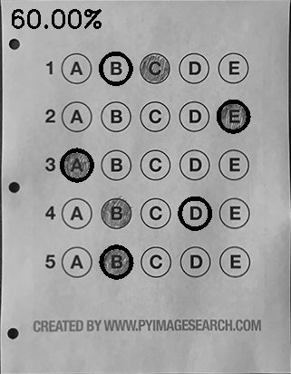

### ·功能： 对答题卡进行识别并且判卷

### 大致思路：

#### 1、读取答题卡，进行预处理，进行检测轮廓

#### 2、对图像进行透视变换，再进行阈值处理，找到所有需要的圆圈轮廓（也就是答题卡上的每个选项）

#### 3、把找到的轮廓从上到下进行排序，制作一个mask,通过计算mask区域中的非零点数量来计算是否是选择这个选项，并且得到其轮廓序号

#### 4、用轮廓序号与答案对比，计算得分

#### 效果展示：

Blurred:

edged:

contours_img:

warped:

thresh:

thresh_Contours:

mask1:

mask2:

Original:

Exam:
